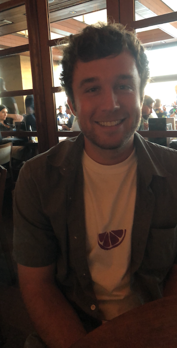

```{r setup, include=FALSE}
knitr::opts_chunk$set(echo = TRUE)
```

## About Adam



* One thing I would love to analyze data about is how many college students that aren't 21 drink alcohol on a regular basis, i.e. at least once a week.  
* After graduation, I hope to be able to spend a few months not working, but rather traveling and doing things I enjoy while being picky in choosing a career path.  By 6 months after graduation I would love to be starting my first real job that could end up leading into a career, and then by 5 years post graduation I hope to be completely decided in where I am going with my career, and have a really good head start on it.  What would make me most happy is being able to use data science to help affect the world in a positive way.  
* My greatest career achievement would be to make a strong impact in whatever field I end up in by creating something new that will help change the way people in that field think about things and approach data.  
* In this course, I hope to develop a stronger understanding of how to utilize data in the world of computer science because I know  I will need these skills to pursue a career in the future.  
* One interesting thing about me is that my interest in Data and Statistics came largely from the book/movie Moneyball, about Billy Beane who greatly influenced a change in how people approach scouting in Major League Baseball.


